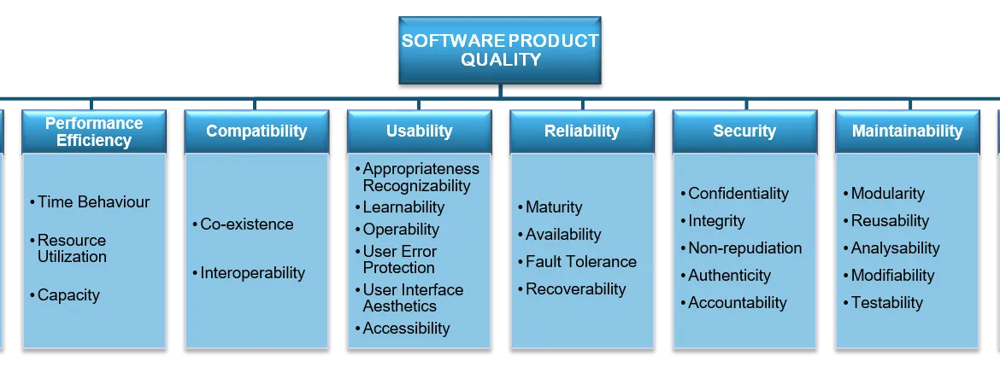
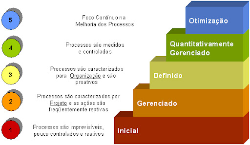
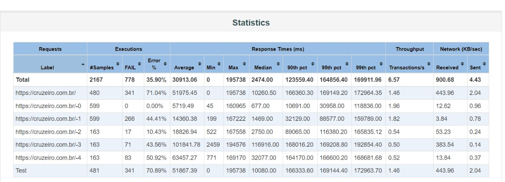
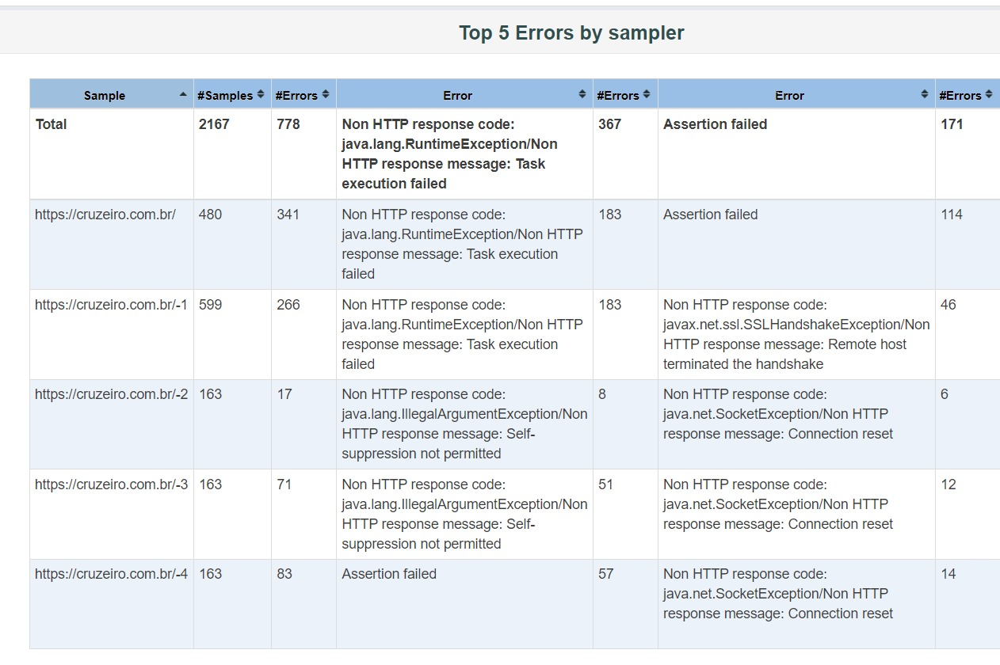
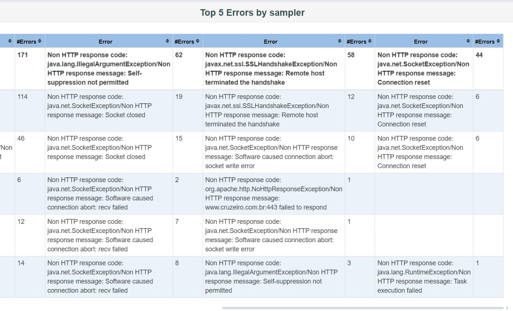
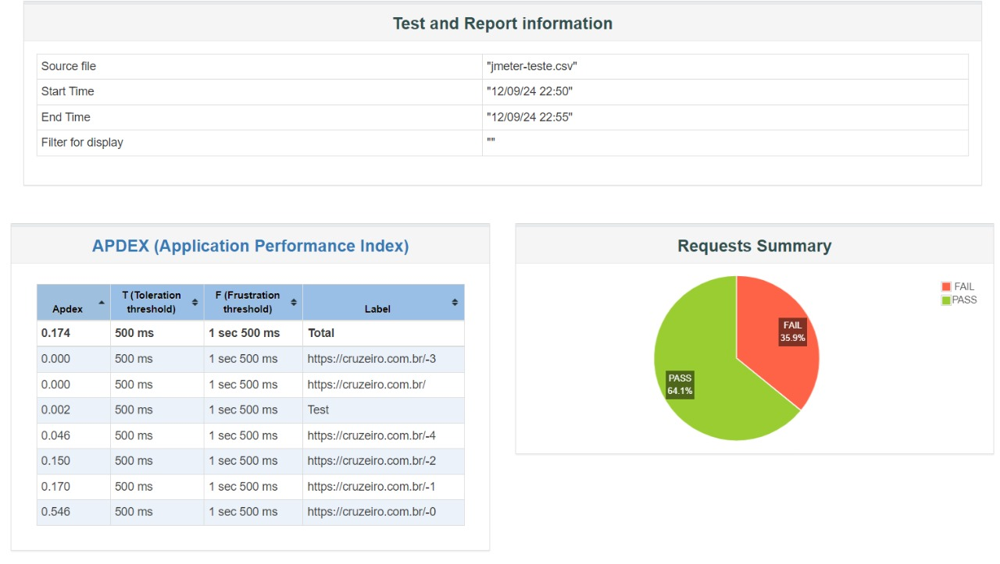

# Projeto de Testes Automatizados e Controle de Qualidade de Software

**Nome do Projeto:** Testes Automatizados e Controle de Qualidade de Software

**Nome do Parceiro:** Congny

**Nome do Grupo:** InCongny

**Integrantes do grupo:** Émely Tavares, Isabela Rocha, Luis Miranda, Luiz Fernando Covas, Maurício Felicissimo e Yuri Toledo

### **Conteúdo**

- [Visão de Negócios](#visão-de-negócios)
- [Riscos e Oportunidades](#riscos-e-oportunidades)
- [Diagnóstico de Controle de qualidade dos Business Drivers Sustentados Pelo Sistema](#Diagnóstico-de-Controle-de-qualidade-dos-Business-Drivers-Sustentados-Pelo-Sistema)
- [Document as a Test dos Business Drivers](#-Document-as-a-Test-dos-Business-Drivers)
- [Referências](#referências)

# Visão de negócios
## Parceiro de negócios - Cogny

A Cogny é uma empresa especializada em produtos para os mercados de Esporte e Loyalty, com foco no desenvolvimento de soluções para seus clientes.

## Problema

O aplicativo desenvolvido pela Cogny em React Native, que já está em produção em várias empresas, sofre de uma ausência significativa de testes automatizados. Isso resulta em diversos problemas que afetam a estabilidade e a qualidade do software, devido à falta de uma estrutura de testes integrada no fluxo de desenvolvimento​.

# Riscos e oportunidades

### Matriz de Risco

| Risco | Impacto | Probabilidade | Mitigação | Responsável |
| --- | --- | --- | --- | --- |
| Falha na Implementação de Testes Automatizados | Alto | Média | Realizar revisões de código frequentes e pair programming para garantir a qualidade dos testes. | Líder Técnico |
| Desempenho Degradado Durante Horários de Pico | Alto | Alta | Implementar testes de carga e stress adequados, ajustando a infraestrutura conforme necessário. | Engenheiro DevOps |
| Problemas de Sincronização com Firebase e Salesforce | Alto | Baixa | Monitoramento contínuo dos logs e ajustes no sistema de atualização em tempo real. | Engenheiro de Backend |
| Falha na Autenticação de Usuários devido à Má Configuração de Testes | Alto | Média | Testar autenticação com diferentes cenários e usuários fictícios antes de ir para produção. | Engenheiro de Backend |
| Sobrecarga de Requisições Durante Eventos Especiais (e.g., Finais de Campeonato) | Alto | Alta | Implementar mecanismos de auto-escalonamento e balanceamento de carga. | Engenheiro DevOps |

### Matriz de oportunidades

| Oportunidade | Impacto | Probabilidade | Aproveitamento | Responsável |
| --- | --- | --- | --- | --- |
| Aprimorar a Eficiência dos Testes Automatizados com Integração Contínua | Alto | Alta | Aproveitar as ferramentas de CI/CD para detectar erros mais rapidamente e melhorar a qualidade geral do código. | Líder Técnico |
| Oportunidade de Estabelecer Novas Práticas de TDD na Organização | Alto | Alta | Usar este projeto como um case para promover o TDD em outros projetos da Cogny. | Líder Técnico |
| Uso de Feedback dos Usuários para Melhorar a Interface e Experiência de Usuário (UX/UI) | Alto | Média | Coletar dados dos usuários sobre a interface do aplicativo e iterar sobre o design para melhorar a experiência geral. | Designer de Produto |
| Geração de Novos Relatórios de Performance para Aumentar a Eficiência Operacional | Médio | Alta | Criar relatórios detalhados de performance a partir dos testes de volumetria para otimizar a infraestrutura e reduzir custos. | Engenheiro DevOps |


# Diagnóstico de Controle de qualidade dos Business Drivers Sustentados Pelo Sistema

## Cliente Final: Diagnóstico de Volume de Serviços e Sazonalidade

### Teste de Volume de Serviço e Sazonalidade

```go
package main

import (
    "testing"
)

func TestVolumetria(t *testing.T) {
    const numUsers = 665000           // Número de usuários totais
    const numConcurrentUsers = 10000  // Número de usuários simultâneos
    const numConcurrentUsersMargin = 30000  // Número de requisições simultâneos com margem de 3x
    const numConcorrentUsersPeak = 50000  // Metade dos usuários totais
    const responseTime = 200 // ms

    // Cenário de testes em horário de volumetria comum
    // Detalhes dos cenários de teste...
}

```

**Descrição:** Este teste simula cenários de uso em horários de pico e horários normais, avaliando o comportamento da aplicação quando submetida a diferentes cargas de usuários simultâneos.

**Métricas Consideradas:**

- **Nº de Usuários:** 665.000
- **Volume Médio:** 50.000 usuários simultâneos
- **Horários de Pico Diário:** Almoço (12:00-14:00) e Fim do Dia (18:00-21:00)
- **Horários de Pico Semanal:** Domingo e Quarta-feira
- **Horários de Pico Anual:** Março a Dezembro

## Executiva/Administrativo/Financeiro: Alcance Geográfico e Setorial

### Teste de Alcance Geográfico e Setorial

```go
// Teste de Alcance Geográfico e Setorial
func Testlocation(t *testing.T) {
    Email := "teste@gmail.com"
    Senha := "20testar70escapar"
    response := Login(Email, Senha)
    if response.status != "OK" {
        t.Errorf("Erro na requisição, status: '%s'", response.Status)
        fmt.Printf("Dados do usuário: %+v\\n", response.User)
        log.Printf("Erro na requisição, status: '%s', Dados do usuário: %+v", response.Status, response.User)
    } else {
        fmt.Printf("Requisição bem-sucedida. Dados do usuário: %+v\\n", response.User)
        log.Printf("Requisição bem-sucedida. Dados do usuário: %+v", response.User)
    }
}

```

**Descrição:** Este teste simula a autenticação de um usuário utilizando e-mail e senha. O objetivo é verificar se a função `Login` retorna um status "OK" quando as credenciais são corretas. Em caso de falha, os dados do usuário são exibidos para facilitar a depuração.

**Estrutura do Usuário:**

```go
type Endereco struct {
    Rua    string
    Numero string
    Cidade string
    Estado string
}
type User struct {
    Id              string
    Email           string
    Senha           string
    Endereco        Endereco
    Telefone        string
    DataNascimento  time.Time
}

```

# Document as a Test dos Business Drivers

## Qualidade de software

### ISO

A norma ISO 25010 é um modelo amplamente reconhecido para avaliar a qualidade de produtos de software. Ela fornece uma estrutura detalhada que categoriza a qualidade do software em oito características principais, como eficiência de desempenho, usabilidade, confiabilidade, segurança e manutenibilidade. Essas características são importantes para garantir que o software atenda às expectativas dos usuários finais e seja capaz de operar de maneira eficaz em diferentes condições. A ISO 25010 também aborda aspectos de compatibilidade e portabilidade, garantindo que o software possa ser integrado e operado em diferentes ambientes tecnológicos. Implementar as diretrizes da ISO 25010 ajuda as organizações a desenvolverem software de alta qualidade, que seja confiável, seguro e fácil de usar. Acesse o link para ler mais sobre a ISO 25010: https://blog.onedaytesting.com.br/iso-iec-25010/



### Usabilidade: Estética da UI (User Interface)

A usabilidade é um aspecto importante para a qualidade de software, pois determina quão facilmente os usuários conseguem interagir com o sistema. A estética da interface do usuário (UI) não só contribui para uma experiência de usuário mais agradável, mas também influencia a perceção de confiabilidade e profissionalismo do software. Uma UI bem desenhada, que seja visualmente apelativa e intuitiva, facilita a navegabilidade e reduz a curva de aprendizado, promovendo uma interação mais eficaz e satisfatória.

No contexto do projeto da Cogny, a confiabilidade e a maturidade são componentes que estão sendo implementados para assegurar a alta qualidade do software desenvolvido.

**Confiabilidade** refere-se à capacidade do software de executar suas funções esperadas de maneira consistente e precisa, sem falhas, ao longo do tempo. No projeto da Cogny, a confiabilidade está sendo garantida através de teste automatizado e controle de qualidade. Utilizando práticas de TDD (Test-Driven Development), cada componente do sistema é submetido a testes unitários. Também são realizados testes de estresse e carga para avaliar como o software se comporta sob condições extremas, assegurando que ele permaneça funcional e responsivo mesmo em cenários de alta demanda.

**Maturidade** se refere ao grau de eficácia e previsibilidade dos processos organizacionais ao longo do tempo, especialmente no que diz respeito ao manuseio de erros e ao suporte de operações contínuas. Na projeto, a maturidade é alcançada através da adoção de processos padronizados e do uso de ferramentas de monitoramento e logging que rastreiam a performance e a estabilidade do software em tempo real.

### CMMI

O Capability Maturity Model Integration (CMMI) é um modelo de melhoria de processos que fornece às organizações elementos essenciais para um processo eficaz. O CMMI ajuda as organizações a melhorar suas capacidades de desenvolvimento, gerenciamento de projetos e serviços, bem como a qualidade dos produtos e serviços que oferecem. Estruturado em níveis de maturidade, o CMMI guia as organizações desde processos inicialmente reativos e não padronizados até processos otimizados e previsíveis, onde a melhoria contínua é uma prática central. Adotar o CMMI contribui para a minimização de riscos e para o aumento da eficiência e eficácia dos processos organizacionais.



A adoção do modelo CMMI no desenvolvimento de software na Cogny permite que a empresa melhore continuamente seus processos e produtos, garantindo alta qualidade e eficiência. O software da Cogny, ao aderir às práticas recomendadas pelo CMMI, é desenvolvido com um foco estruturado em gerenciamento de projetos, controle de qualidade e melhoria contínua. Isso assegura que o software não apenas atenda às necessidades atuais dos clientes, mas também se adapte rapidamente a mudanças e cresça com as exigências futuras do mercado, além de trazer maior robustez e confiabilidade para os produtos desenvolvidos pela Cogny.


### Testar Parâmetros de Volume de Serviços e Sazonalidade


```go
package main
import (
    "testing"
)
func TestVolumetria(t *testing.T) {
    const numUsers = 665000           // Número de usuários totais
    const numConcurrentUsers = 10000  // Número de usuários simultâneos
    const numConcurrentUsersMargin = 30000  // Número de requisições simultâneos com margem de 3x
    const numConcorrentUsersPeak = 50000  // Metade dos usuários totais
    const responseTime = 200 // ms
    // cenário de testes em horário de volumetria comum
        // chegada de 3 requisições a mais por segundo até bater o número de usuários atuais 0 - 10000
        // chegada de 10000 requisições por segundo durante 10 segundos
        // chegada de 10000 requisições por segundo durante 30 segundos
        // chegada de 10000 requisições por segundo durante 60 segundos
        // chegada de 10000 requisições por segundo durante 120 segundos
        // chegada de 10000 requisições por segundo durante 300 segundos
    // cenário de testes em horário de pico
        // chegada de 3 requisições a mais por segundo até bater o número de usuários atuais 0 - 50000
        // chegada de 50000 requisições por segundo durante 10 segundos
        // chegada de 50000 requisições por segundo durante 30 segundos
        // chegada de 50000 requisições por segundo durante 60 segundos
        // chegada de 50000 requisições por segundo durante 120 segundos
        // chegada de 50000 requisições por segundo durante 300 segundos
    // cenário
}
```

### Testar Alcance Geográfico e Setorial

```go
// O teste simula um cenário onde um usuário tenta se autenticar com um 
// email e senha específicos. O objetivo é garantir que a função Login retorne um status "OK" 
// quando as credenciais estão corretas e imprima os dados do usuário correspondente. 
// Caso o status não seja "OK", o teste falha e exibe uma mensagem de erro, juntamente com 
// os dados do usuário, para facilitar a depuração.
func Testlocation(t *testing.T) {
    //Cenario de teste
    Email := "teste@gmail.com"
    Senha := "20testar70escapar"
    response := Login(Email, Senha)
    if response.status != "OK" {
        t.Errorf("Erro na requisição, status: '%s'", response.Status)
        fmt.Printf("Dados do usuário: %+v\n", response.User)
        // Log dos dados para monitoramento
        log.Printf("Erro na requisição, status: '%s', Dados do usuário: %+v", response.Status, response.User)
    } else {
        fmt.Printf("Requisição bem-sucedida. Dados do usuário: %+v\n", response.User)
        // Log dos dados para monitoramento
        log.Printf("Requisição bem-sucedida. Dados do usuário: %+v", response.User)
        // O log foi adicionado para capturar e armazenar os detalhes da requisição e os dados do usuário
        // para monitoramento contínuo. Essas informações serão registradas no sistema de logs da aplicação,
        // permitindo a análise posterior de sucesso ou falha nas tentativas de login por localidade (cidade e estado).
    }
}
```
## Implementação de Testes Unitários com Dados Mockados

O objetivo principal desta etapa é assegurar que as funcionalidades-chave do aplicativo, tais como navegação, entrada de dados, acionamento de botões, tratamento de erros, memórias de interface, efetivação de transações e feedbacks de efetivação, funcionem conforme o esperado para diferentes tipos de usuários.

Abordagem
Testes para Usuários - Clientes:

Funcionalidades Focadas: Neste contexto, os testes são focados na navegação, entrada de dados e acionamento de botões.
Massa de Testes: São utilizadas diferentes massas de testes para simular navegações normais, navegações com erros e cenários de quebra de serviços. Esses testes são essenciais para garantir que o aplicativo responda adequadamente sob diversas condições de uso, evidenciando a robustez do sistema.
Testes para Usuários Internos e Outros:

Funcionalidades Focadas: Assim como para os usuários-clientes, as funcionalidades testadas incluem navegação, entrada de dados e acionamento de botões.
Massa de Testes: A navegação normal, navegação com erros e navegação com quebra de serviços são novamente testadas. A diversidade de condições de acesso garante que os testes abranjam uma ampla gama de cenários, assegurando a qualidade da experiência do usuário.

#### Alguns Testes Implementados
1. Validação de preenchimento (Email valido)
```go
func TestValidarEmail(t *testing.T) {
	test := []struct{
		email string
		expectError bool
	}{
		{"teste@dominio.com", false},     // Email válido
		{"usuario@dominio.co", false},    // Email válido com TLD curto
		{"nome.sobrenome@dominio.com.br", false}, // Email válido com TLD longo
		{"email@dominio", true},          // TLD incompleto, deve gerar erro
		{"@dominio.com", true},           // Ausência de nome, deve gerar erro
		{"nome@.com", true},              // Ausência de domínio, deve gerar erro
		{"nome@dominio.", true},          // TLD incompleto, deve gerar erro
		{"", true},                       // Email vazio, deve gerar erro
	}
	for _, tt := range test {
		err := ValidarEmail(tt.email)

		if tt.expectError{
			require.Error(t, err, "Esperado erro ao validar o email: %v", tt.email)
		}else{
			require.NoError(t, err, "Não esperado erro ao validar email: %v", tt.email)
		}
	}
}
```

2. Validação de preenchimento (Telefone valido)
```go
func TestValidarTelefone(t *testing.T) {

	test := []struct {
		phone string
		expectError bool
	}{
		{"(11) 98888-7777", false},	 // Telefone válido com DDD e número completo
		{"(21) 3222-1234", false},	 // Telefone fixo válido com DDD
		{"11988887777", true},       // Formato inválido (falta parênteses e hífen), deve gerar erro
		{"(11)98888-7777", true},    // Falta espaço entre DDD e número, deve gerar erro
		{"(11) 9888-7777", true},    // Número incompleto, deve gerar erro
		{"(1) 98888-777777", true},    // DDD inválido e número muito longo, deve gerar erro
		{"", true},			 // Telefone vazio, deve gerar erro
	}

	for _, tt := range test {
		err := ValidarTelefone(tt.phone)

		if tt.expectError{
			require.Error(t, err, "Esperado erro ao validar o telefone: %v", tt.phone)
		} else {
			require.NoError(t, err, "Não esperado erro ao validar telefone: %v", tt.phone)
		}
	}
}
```

3. Validação de Existência de Emails

```go
package test_cadastro

import (
	"testing"

	"github.com/stretchr/testify/require"
)

func TestEmailExisteNoBanco(t *testing.T) {
	test := []struct {
		email  string
		exists bool
	}{
		{"teste@example.com", true},    // Caso de teste onde o email "teste@example.com" deve existir.
		{"naoexiste@example.com", false}, // Caso de teste onde o email "naoexiste@example.com" não deve existir.
	}

	for _, tt := range test {
		exists, err := EmailExisteNoBanco(tt.email)
		require.NoError(t, err, "Erro inesperado ao verificar a existência do email: %v", tt.email)
		require.Equal(t, tt.exists, exists, "O resultado esperado e o obtido não correspondem para o email: %v", tt.email)
	}
}


```

**Descrição:** O código acima implementa um teste unitário para verificar a existência de emails na base de dados.

4. Validação de Existência de Telefones

```go
package test_cadastro

import (
	"testing"

	"github.com/stretchr/testify/require"
)

func TestTelefoneExisteNoBanco(t *testing.T) {
	test := []struct {
		phone  string
		exists bool
	}{
		{"(11) 98888-7777", true},  // Caso de teste onde o telefone "(11) 98888-7777" deve existir.
		{"(21) 3222-1234", false},  // Caso de teste onde o telefone "(21) 3222-1234" não deve existir.
	}

	for _, tt := range test {
		exists, err := TelefoneExisteNoBanco(tt.phone)
		require.NoError(t, err, "Erro inesperado ao verificar a existência do telefone: %v", tt.phone)
		require.Equal(t, tt.exists, exists, "O resultado esperado e o obtido não correspondem para o telefone: %v", tt.phone)
	}
}


```
    
**Descrição:** Este teste unitário verifica a existência de números de telefone na base de dados.

**Observação:** Outros testes estão disponíveis na pasta src/tests. Cada arquivo de teste inclui comentários detalhados para facilitar o entendimento das funcionalidades testadas

### Conclusão

Os testes descritos acima foram implementados para garantir a integridade dos dados no sistema, verificando a existência de emails e números de telefone na base de dados. Mesmo utilizando dados mockados para a execução dos testes, as validações realizadas são completamente aplicáveis à base de dados real. Esses testes são fundamentais para assegurar que o sistema esteja operando corretamente e que as informações fornecidas pelos usuários estejam devidamente validadas.

# Documentação dos Testes com JMeter

## Objetivo dos Testes

O objetivo dos testes realizados com o JMeter foi avaliar a performance, a navegação e o tratamento de erros do site do Cruzeiro (https://www.cruzeiro.com.br/). Os testes focaram em simular cenários reais de navegação, medindo a eficácia da interface e o comportamento do sistema sob condições normais e de erro.

## Configuração do Ambiente de Teste

- **Ferramenta utilizada:** Apache JMeter
- **Versão do JMeter:** 5.4.1
- **Endereço do site testado:** https://www.cruzeiro.com.br/
- **Tipo de testes realizados:** Testes de carga, navegação, e tratamento de erros
- **Configurações de Thread Group:** 
  - Número de usuários virtuais: 10
  - Tempo de ramp-up: 10 segundos
  - Duração total do teste: 60 segundos

## Plano de Teste JMeter

### Estrutura do Plano de Teste

O plano de teste foi estruturado para simular uma carga de 10 usuários simultâneos acessando diferentes partes do site. A configuração incluiu:

1. **Thread Group:** Define o número de usuários simultâneos, o tempo de ramp-up e a duração do teste.
2. **HTTP Requests:** Simula as requisições HTTP para as diferentes seções do site.
3. **Assertions:** Verificações para garantir que as respostas estão corretas e dentro dos parâmetros esperados.
4. **Listeners:** Para coletar e apresentar os dados dos testes em forma de gráficos e tabelas.

### Trecho de Código do Plano de Teste

```xml
<TestPlan guiclass="TestPlanGui" testclass="TestPlan" testname="Cruzeiro Test Plan" enabled="true">
    <hashTree>
        <ThreadGroup guiclass="ThreadGroupGui" testclass="ThreadGroup" testname="User Simulation" enabled="true">
            <stringProp name="ThreadGroup.num_threads">10</stringProp>
            <stringProp name="ThreadGroup.ramp_time">10</stringProp>
            <stringProp name="ThreadGroup.duration">60</stringProp>
            <!-- Configurações de threads, loops, ramp-up, etc. -->
        </ThreadGroup>
        <hashTree>
            <!-- Requisição para a página inicial -->
            <HTTPSamplerProxy guiclass="HttpTestSampleGui" testclass="HTTPSamplerProxy" testname="Cruzeiro Home Page" enabled="true">
                <stringProp name="HTTPSampler.domain">www.cruzeiro.com.br</stringProp>
                <stringProp name="HTTPSampler.port">80</stringProp>
                <stringProp name="HTTPSampler.protocol">http</stringProp>
                <stringProp name="HTTPSampler.path">/</stringProp>
                <stringProp name="HTTPSampler.method">GET</stringProp>
            </HTTPSamplerProxy>
            <hashTree>
                <!-- Assertion para verificar a resposta HTTP 200 -->
                <ResponseAssertion guiclass="AssertionGui" testclass="ResponseAssertion" testname="Check response code" enabled="true">
                    <collectionProp name="Asserion.test_strings">
                        <string>200</string>
                    </collectionProp>
                    <stringProp name="Assertion.test_field">Assertion.response_code</stringProp>
                </ResponseAssertion>
            </hashTree>
            
            <!-- Requisição para a página de compras de ingressos -->
            <HTTPSamplerProxy guiclass="HttpTestSampleGui" testclass="HTTPSamplerProxy" testname="Cruzeiro Tickets Page" enabled="true">
                <stringProp name="HTTPSampler.domain">www.cruzeiro.com.br</stringProp>
                <stringProp name="HTTPSampler.port">80</stringProp>
                <stringProp name="HTTPSampler.protocol">http</stringProp>
                <stringProp name="HTTPSampler.path">/tickets</stringProp>
                <stringProp name="HTTPSampler.method">GET</stringProp>
            </HTTPSamplerProxy>
            <hashTree>
                <!-- Assertion para verificar que a página contém o texto 'Ingressos' -->
                <ResponseAssertion guiclass="AssertionGui" testclass="ResponseAssertion" testname="Check page content" enabled="true">
                    <collectionProp name="Asserion.test_strings">
                        <string>Ingressos</string>
                    </collectionProp>
                    <stringProp name="Assertion.test_field">Assertion.response_data</stringProp>
                </ResponseAssertion>
            </hashTree>
            
            <!-- Requisição POST para simular login -->
            <HTTPSamplerProxy guiclass="HttpTestSampleGui" testclass="HTTPSamplerProxy" testname="Login Request" enabled="true">
                <stringProp name="HTTPSampler.domain">www.cruzeiro.com.br</stringProp>
                <stringProp name="HTTPSampler.port">80</stringProp>
                <stringProp name="HTTPSampler.protocol">http</stringProp>
                <stringProp name="HTTPSampler.path">/login</stringProp>
                <stringProp name="HTTPSampler.method">POST</stringProp>
                <elementProp name="HTTPsampler.Arguments" elementType="Arguments">
                    <collectionProp name="Arguments.arguments">
                        <elementProp name="username" elementType="HTTPArgument">
                            <stringProp name="Argument.value">testuser</stringProp>
                        </elementProp>
                        <elementProp name="password" elementType="HTTPArgument">
                            <stringProp name="Argument.value">testpass</stringProp>
                        </elementProp>
                    </collectionProp>
                </elementProp>
            </HTTPSamplerProxy>
            <hashTree>
                <!-- Assertion para verificar a resposta de login -->
                <ResponseAssertion guiclass="AssertionGui" testclass="ResponseAssertion" testname="Login response check" enabled="true">
                    <collectionProp name="Asserion.test_strings">
                        <string>Welcome</string>
                    </collectionProp>
                    <stringProp name="Assertion.test_field">Assertion.response_data</stringProp>
                </ResponseAssertion>
            </hashTree>
        </hashTree>
    </hashTree>
</TestPlan>
```
### Teste de carga usadno Jmeter

Com o intuito de verificar a confiabilidade e robustez da plataforma do Cruzeiro, desenvolvida pela Cogny, foram realizados testes de disponibilidade no site. O RNF de Disponibilidade foi escolhido como critério para esses testes de carga, devido à sua importância em garantir que o site permaneça acessível aos usuários, mesmo sob condições de alta demanda. O objetivo desses testes foi identificar possíveis gargalos e vulnerabilidades que poderiam comprometer a experiência do usuário em situações de uso intenso.

### Metodologia dos Testes

Os testes foram conduzidos utilizando a ferramenta JMeter, que permite a simulação de múltiplas requisições simultâneas ao servidor para avaliar o comportamento do sistema em condições de stress. Realizamos duas rodadas principais de testes para medir a resiliência da aplicação sob diferentes níveis de carga.

### Primeira Rodada de Testes: 100 Requisições por Segundo

Iniciamos os testes com um cenário de 100 requisições por segundo. O objetivo era verificar se o sistema conseguia lidar com essa carga sem comprometer sua disponibilidade. Todos os testes passaram sem erros, o que indica que a aplicação é capaz de suportar essa quantidade de acessos simultâneos sem falhas significativas.



### Segunda Rodada de Testes: 300 Requisições por Segundo

Para explorar os limites da aplicação, aumentamos a carga para 300 requisições por segundo. Neste cenário, observamos um aumento significativo no número de erros. Os tipos de erros mais comuns foram timeouts e falhas de conexão, sugerindo que o servidor não conseguiu processar o volume de requisições dentro do tempo esperado. Além disso, em alguns casos, detectamos que o site estava bloqueando requisições, uma possível medida de proteção contra ataques de negação de serviço (DoS).





## Resultados dos Testes

Os testes confirmaram que o sistema é robusto para cargas moderadas, mas enfrenta dificuldades com cargas altas, necessitando de ajustes para melhorar a resiliência e a disponibilidade sob condições de stress:



- **APDEX (Application Performance Index)**: Indicador de 0,174, mostrando que a maioria das requisições não atingiu o tempo de resposta esperado.
- **Resumo de Requisições**: 64,1% das requisições passaram, enquanto 35,9% falharam sob alta carga.
- **Estatísticas Detalhadas**: A tabela de estatísticas detalha a média, o mínimo, o máximo e os percentis de tempo de resposta, evidenciando que a aplicação começa a falhar significativamente sob maior carga.
- **Top 5 Erros por Amostragem**: A maior parte dos erros está relacionada a falhas de execução de tarefas e erros de handshake SSL, o que pode indicar sobrecarga no servidor ou medidas de segurança ativadas para mitigar possíveis ameaças.

Os testes confirmaram que o sistema é robusto para cargas moderadas, mas enfrenta dificuldades com cargas altas, necessitando de ajustes para melhorar a resiliência e a disponibilidade sob condições de stress.


# Requisitos Não Funcionais 

## Tempo de resposta

### Sistema em malha aberta

O sistema é feito em malha aberta, em que as ações de controle não são tomadas automaticamente com base em um ciclo fechado de feedback. Em vez disso, o sistema depende de intervenções pré-programadas e ajustes manuais, sendo menos reativo a mudanças em tempo real. No contexto do controle de tempo de resposta da Cogny, o sistema não possui um ciclo automático de detecção e resposta a problemas. As decisões são baseadas em intervenções manuais ou programadas com base em monitoramento periódico.

A partir disso, o ideal seria implementarmos a malha fechada, que funciona de forma a ajustar dinamicamente a infraestrutura, garantindo que o sistema atenda aos requisitos de desempenho, mesmo em cenários de alta carga, como a de alta demanda na venda de ingressos em horários específicos.


### Táticas arquiteturais 

A tática arquitetural utilizada é a de tempo de resposta, na qual tem como objetivo garantir que o sistema consiga detectar e lidar com picos de demanda de compras de ingressos automaticamente.


### Regstros de ocorrências e incidentes do sistema

Todas as requisições no sistema atual são registradas para garantir rastreabilidade completa. Cada requisição gerada é armazenada em logs, o que nos permite monitorar e acompanhar o histórico de todas as operações realizadas pelo sistema. Isso proporciona visibilidade e controle detalhado sobre o comportamento do sistema em produção, permitindo uma análise mais precisa de falhas e desempenho.

Nossa abordagem de implementação é baseada em testes automatizados, com foco em testes mockados. Utilizamos mocks para simular cenários e verificar o comportamento do sistema sem depender de todos os serviços e componentes externos em funcionamento.

Atualmente, o sistema opera em malha aberta, onde as ações são tomadas manualmente com base no monitoramento contínuo. No entanto, nossa próxima sprint está planejada para implementar a transição para uma malha fechada. Isso permitirá que o sistema reaja automaticamente a anomalias e degradações de performance, ajustando recursos e escalando servidores sem intervenção humana. A adoção da malha fechada vai melhorar a capacidade de resposta do sistema e garantir maior estabilidade durante picos de demanda.


# Referências

CMMI: https://learn.microsoft.com/pt-br/azure/devops/boards/work-items/guidance/cmmi/guidance-background-to-cmmi?view=azure-devops
ISO: https://iso25000.com/index.php/en/iso-25000-standards/iso-25010
